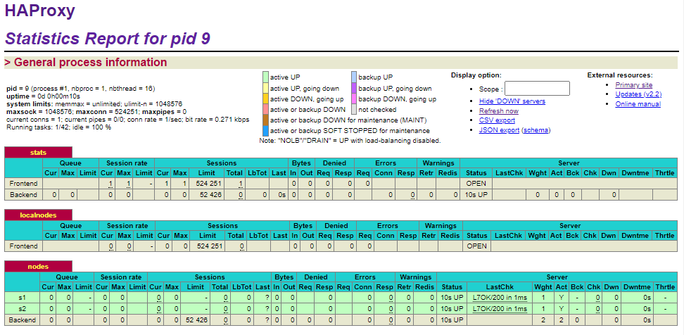
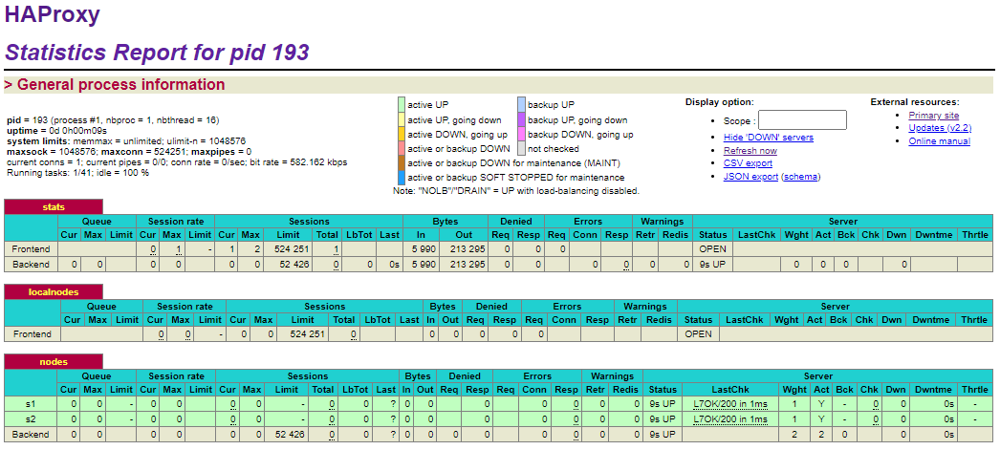
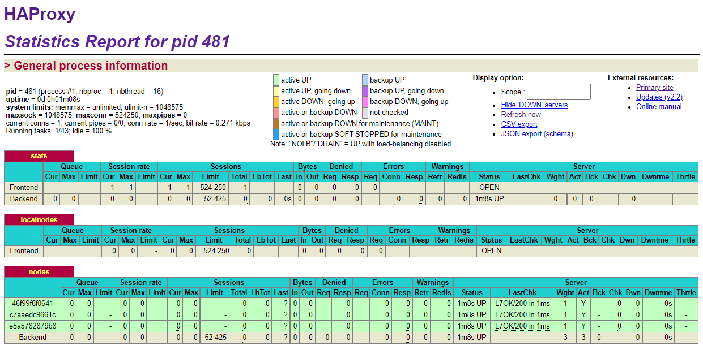
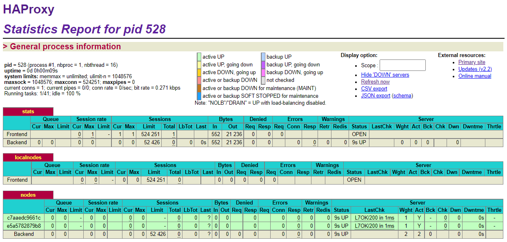
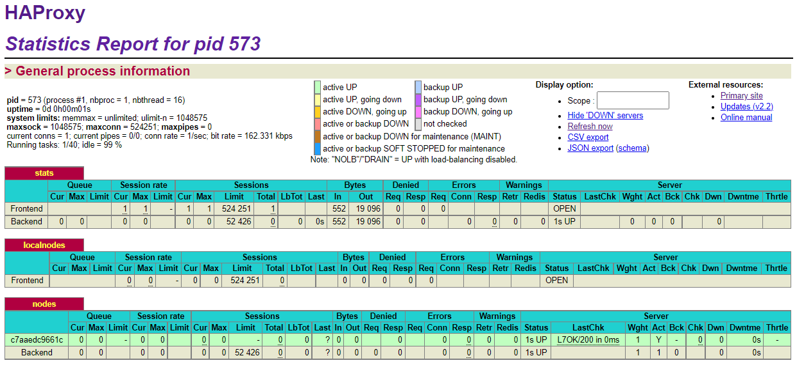
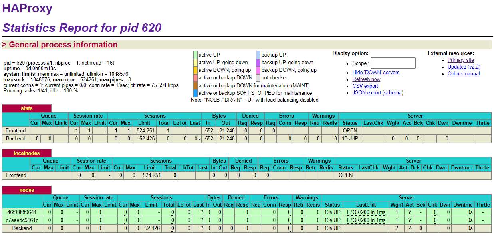

# Lab 04 - Docker
## Authors 
Diego Villagrasa

Michael Ruckstuhl

Fabio Da Silva Marques

# Table of Contents
1. [Introdcution](#introduction)
2. [Tasks](#tasks)
3. [Difficulties](#difficulties)
4. [Conclusion](#conclusion)

# Introdcution

The goal of this lab is to setup, configure and test a dynamic load balancing system that is able to accept and remove nodes from it's pool without having to moddify the configuration manually and restart the server.

To achieve this, we'll integrate Serf to our nodes so they can automatically join and leave the cluster and automatically update the HAProxy configuration to reflect the active nodes.

# Tasks

## Task 0: Identify issues and install the tools

    [M1] Do you think we can use the current solution for a production environment? What are the main problems when deploying it in a production environment?

No, we cannot use the current solution for a production environment because we don't have any monitoring of the status of the nodes to reboot or spin more if one is offline. We also have no automatic way to scale the infrastructure with demand.

    [M2] Describe what you need to do to add new
    `webapp` container to the infrastructure. Give the exact steps of
    what you have to do without modifiying the way the things are
    done. Hint: You probably have to modify some configuration and
    script files in a Docker image.

First we need to add the information about the new node to the .env file like so:

```yaml
WEBAPP_3_NAME=s3
WEBAPP_3_IP=192.168.42.33
```


Then we need to add the new wepapp to the docker-compose.yml file:
        
```yaml
webapp3:
container_name: ${WEBAPP_3_NAME}
build:
    context: ./webapp
    dockerfile: Dockerfile
networks:
    heig:
    ipv4_address: ${WEBAPP_3_IP}
ports:
    - "4002:3000"
environment:
    - TAG=${WEBAPP_3_NAME}
    - SERVER_IP=${WEBAPP_3_IP}

haproxy:
container_name: ha
build:
    context: ./ha
    dockerfile: Dockerfile
ports:
    - 80:80
    - 1936:1936
    - 9999:9999
expose:
    - 80
    - 1936
    - 9999
networks:
    heig:
    ipv4_address: ${HA_PROXY_IP}
environment:
        - WEBAPP_1_IP=${WEBAPP_1_IP}
        - WEBAPP_2_IP=${WEBAPP_2_IP}
        - WEBAPP_3_IP=${WEBAPP_3_IP}
```
     
We also need to change the config in haproxy.cfg to add the new backend node:

```yaml
server s1 ${WEBAPP_1_IP}:3000 check
server s2 ${WEBAPP_2_IP}:3000 check
server s3 ${WEBAPP_3_IP}:3000 check
```
    
    [M3] Based on your previous answers, you have detected some issues in the current solution. Now propose a better approach at a high level.

We need to be able to automate the process of adding and removing nodes to haproxy.

    [M4] You probably noticed that the list of web
        application nodes is hardcoded in the load balancer
        configuration. How can we manage the web app nodes in a more dynamic
        fashion?

We could monitor the load on each nodes and edit the configuration of haproxy to start or remove nodes as needed. For example if we see that the current nodes are overloaded we could add a new one to the pool.

    [M5] In the physical or virtual machines of a
    typical infrastructure we tend to have not only one main process
    (like the web server or the load balancer) running, but a few
    additional processes on the side to perform management tasks.

    For example to monitor the distributed system as a whole it is
    common to collect in one centralized place all the logs produced by
    the different machines. Therefore we need a process running on each
    machine that will forward the logs to the central place. (We could
    also imagine a central tool that reaches out to each machine to
    gather the logs. That's a push vs. pull problem.) It is quite
    common to see a push mechanism used for this kind of task.

    Do you think our current solution is able to run additional
    management processes beside the main web server / load balancer
    process in a container? If no, what is missing / required to reach
    the goal? If yes, how to proceed to run for example a log
    forwarding process?

To run multiple processes in a container we need to use a custom script as the process started by docker. This will allow us to run multiple processes from it like the web server and the log forwarding service.


    [M6] In our current solution, although the
    load balancer configuration is changing dynamically, it doesn't
    follow dynamically the configuration of our distributed system when
    web servers are added or removed. If we take a closer look at the
    `run.sh` script, we see two calls to `sed` which will replace two
    lines in the `haproxy.cfg` configuration file just before we start
    `haproxy`. You clearly see that the configuration file has two
    lines and the script will replace these two lines.

    What happens if we add more web server nodes? Do you think it is
    really dynamic? It's far away from being a dynamic
    configuration. Can you propose a solution to solve this?

It's not dynamic since we have to manually edit the script and restart the haproxy container when we add a new node to the pool.

### Deliverables
    1. Take a screenshot of the stats page of HAProxy at
    <http://192.168.42.42:1936>. You should see your backend nodes.




    2. Give the URL of your repository URL in the lab report.

https://github.com/TheSnekySnek/Teaching-HEIGVD-AIT-2020-Labo-Docker


## Task 1: Add a process supervisor to run several processes

### Deliverable
    1. Take a screenshot of the stats page of HAProxy at
    <http://192.168.42.42:1936>. You should see your backend nodes. It
    should be really similar to the screenshot of the previous task.



    2. Describe your difficulties for this task and your understanding of
    what is happening during this task. Explain in your own words why
    are we installing a process supervisor. Do not hesitate to do more
    research and to find more articles on that topic to illustrate the
    problem.

The process supervisor will let us run multiple processes inside our Docker container.
This will let us add a new process responsible for joining the cluster while we also run our web server.


## Task 2: Add a tool to manage membership in the web server cluster

### Deliverable

    1. Provide the docker log output for each of the containers: `ha`,
    `s1` and `s2`. You need to create a folder `logs` in your
    repository to store the files separately from the lab
    report. For each lab task create a folder and name it using the
    task number. No need to create a folder when there are no logs.

    Example:

    ```
    |-- root folder
        |-- logs
        |-- task 1
        |-- task 3
        |-- ...
    ```

They can be found in 'logs/task 2'

    2. Give the answer to the question about the existing problem with the
    current solution.

         
The problem with our current solution is that nodes are not automatically added to our cluster.

    3. Give an explanation on how `Serf` is working. Read the official
    website to get more details about the `GOSSIP` protocol used in
    `Serf`. Try to find other solutions that can be used to solve
    similar situations where we need some auto-discovery mechanism.

The GOSSIP protocol is a Peer to Peer protocol that uses UDP to propagate messages inside its network.

Serf uses it to register new nodes in a cluster and to know when they go down.


## Task 3: React to membership changes

### Deliverables

    1. Provide the docker log output for each of the containers:  `ha`, `s1` and `s2`.
    Put your logs in the `logs` directory you created in the previous task.

They can be found in the 'logs/task 3' directory

    3. Provide the logs from the `ha` container gathered directly from the `/var/log/serf.log`
    file present in the container. Put the logs in the `logs` directory in your repo.
    
The file is located in 'logs/task 3/serf.log'

##  Task 4: Use a template engine to easily generate configuration files

### Deliverables

    1. You probably noticed when we added `xz-utils`, we have to rebuild
    the whole image which took some time. What can we do to mitigate
    that? Take a look at the Docker documentation on
    [image layers](https://docs.docker.com/engine/userguide/storagedriver/imagesandcontainers/#images-and-layers).
    Tell us about the pros and cons to merge as much as possible of the
    command. In other words, compare:

    ```
    RUN command 1
    RUN command 2
    RUN command 3
    ```

    vs.

    ```
    RUN command 1 && command 2 && command 3
    ```

If we use multiple run commands, docker will only rebuild the image with the new command and the ones that follow.

If we put each one in a single line, docker would have rebuilt the whole image.

There are also some articles about techniques to reduce the image
size. Try to find them. They are talking about `squashing` or
`flattening` images.

    2. Propose a different approach to architecture our images to be able
    to reuse as much as possible what we have done. Your proposition
    should also try to avoid as much as possible repetitions between
    your images.

We could create a new image with everything in common between the images and use it as a base for the images.

    3. Provide the `/tmp/haproxy.cfg` file generated in the `ha` container
    after each step.  Place the output into the `logs` folder like you
    already did for the Docker logs in the previous tasks. Three files
    are expected.

Can be found as 'logs/task 4/haproxy... .log'
   
    In addition, provide a log file containing the output of the 
    `docker ps` console and another file (per container) with
    `docker inspect <container>`. Four files are expected.

Can be found aa 'logs/task 4/ps.log' and 'logs/task4/inspect_#.log'
   
    4. Based on the three output files you have collected, what can you say about the way we generate it? What is the problem if any?

The log file is overrided when a new node joins. This make it impossible to get a history of who joined the cluster.

## Task 5: Generate a new load balancer configuration when membership changes

### Deliverables

    1. Provide the file `/usr/local/etc/haproxy/haproxy.cfg` generated in
    the `ha` container after each step. Three files are expected.

They can be found as 'logs/task 5/haproxy... .cfg'
   
    In addition, provide a log file containing the output of the 
    `docker ps` console and another file (per container) with
    `docker inspect <container>`. Four files are expected.

They can be found as 'logs/task 5/ps.log' and 'logs/task 5/inspect-#.log'

    2. Provide the list of files from the `/nodes` folder inside the `ha` container.
    One file expected with the command output.

Can be found as 'logs/task 5/nodes.log'

    3. Provide the configuration file after you stopped one container and
    the list of nodes present in the `/nodes` folder. One file expected
    with the command output. Two files are expected.

The config file is 'logs/task 5/haproxy-nos1.cfg'

The nodes output is 'logs/task 5/nodes_nos1.log'
   
    In addition, provide a log file containing the output of the `docker ps` console. One file expected.

Can be found as 'logs/task 5/ps_no-s1.log'


## Task 6: Make the load balancer automatically reload the new configuration

### Deliverables

    1. Take a screenshots of the HAProxy stat page showing more than 2 web
    applications running. Additional screenshots are welcome to see a
    sequence of experimentations like shutting down a node and starting
    more nodes.

Here we can see 3 nodes running on our cluster



If we stop the S1 node we can see that it's removed from the cluster.



We can also stop the S3 node.



If we start the S1 node back up we can see it becomes available again.


   
    Also provide the output of `docker ps` in a log file. At least 
    one file is expected. You can provide one output per step of your
    experimentation according to your screenshots.

Each step can be found in 'logs/task 6/ps_step#.log'
   
    2. Give your own feelings about the final solution. Propose
    improvements or ways to do the things differently. If any, provide
    references to your readings for the improvements.

The current solution works but is not optimal. It would be nice to have a way to monitor the health of the nodes so we can replace them if they start to degrade and spin or stop containers when we need to scale the service.


# Difficulties

The major dificulties we had was to log everything for the deliverables which was long. We also had issues in the beginning with the windows line endings but this was solved thanks to the troubleshooting section.

# Conclusion

Some of us had used Serf before to manage a cluster of Docker containers so we already knew how to use it for this purpose before.

But we were able to understand how to configure HaProxy in particular to support dynamic load balancing and how to use a process supervisor to have multiple processes running in a single docker container which is really usefull to know since we are using Docker more and more in our formation.